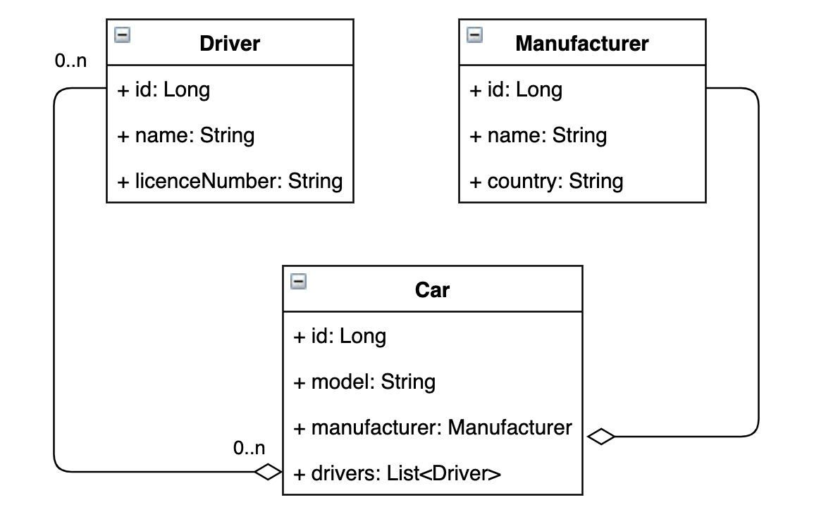

# Awesome Taxi Service

### Features

- Authorization: login page (user creation), possibility to logout from any page. To register a user (driver in our case) you should visit `Add driver` page
- Authentication: implemented limit to access valuable pages for unauthorized users. (Using web filters)
- Getting and Updating information about current drivers, cars and their manufacturer

### Used Technologies

- Tomcat
- 3-layer project architecture
- JavaServer Pages (JSP)
- JDBC with PostgresQL Driver
- JSTL for jsp tags
- WAR (packaging into archive using maven)

### Contribution / Running on your machine

1. Clone this repo
2. Execute `src/main/resources/init.db` to get actual database model
3. Create new branch & make changes 🚀
4. Don't forget to use `mvn clean verify package` before pushing!

## Database UML diagram
